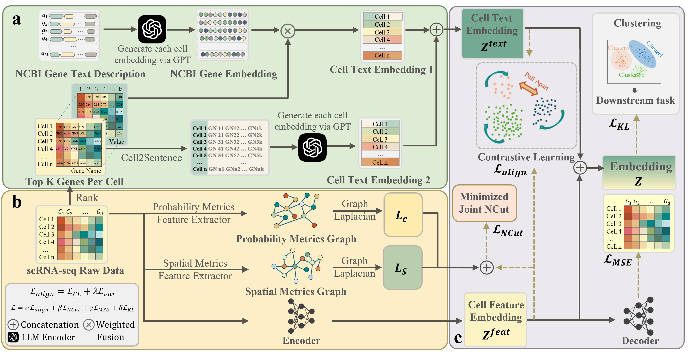
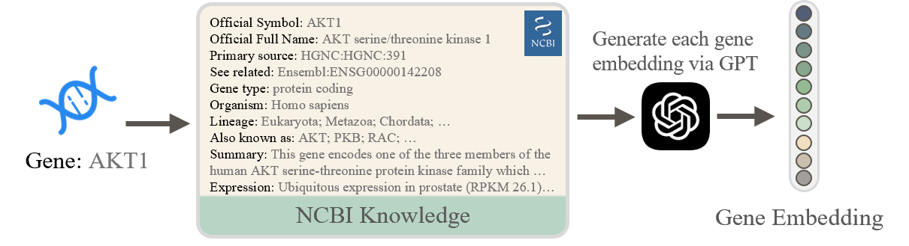

# scLLM-DSC: LLM-Knowledge Enhanced Cross-Modal Deep Structural Clustering for Single-Cell RNA Sequencing

[](LICENSE)
[](https://www.python.org/downloads/)
[](https://pytorch.org/)
[](https://ijcai-26.org/)

**Official PyTorch implementation** of the IJCAI 2026 paper:  
*"LLM-Knowledge Enhanced Cross-Modal Deep Structural Clustering for Single-Cell RNA Sequencing"*

---

## Abstract

Single-cell RNA sequencing (scRNA-seq) has revolutionized our understanding of cellular heterogeneity. However, existing clustering methods suffer from **semantic agnosticism**—they reduce genes to abstract numerical indices, prioritizing expression patterns over functional logic. This limitation results in clusters with limited biological interpretability.

We propose **scLLM-DSC**, a novel framework that transcends purely data-driven paradigms by integrating **Large Language Model (LLM) knowledge** with deep structural clustering. By explicitly encoding NCBI gene annotations via LLMs and aligning them with transcriptomic features through cross-modal contrastive learning, scLLM-DSC produces biologically grounded, interpretable cell clusters.

**Key contributions:**
1. A **knowledge-data dual-driven paradigm** that bridges structural deep learning with semantic biological reasoning
2. **Task-specific synergistic optimization** addressing the objective mismatch between generative pre-training and discriminative clustering
3. **Unified interpretable representation** preserving both topological fidelity and biological meaning

---

## Table of Contents

- [Framework Overview](#framework-overview)
- [Methodology](#methodology)
- [Installation](#installation)
- [Data Preparation](#data-preparation)
- [Usage](#usage)
- [Citation](#citation)
- [License](#license)

---

## Framework Overview

<p align="center">
  
</p>

**Figure 1**: Overview of the scLLM-DSC framework. **(a) Knowledge-Driven Semantic Encoding**: NCBI gene annotations are encoded via frozen LLM encoder to generate gene-level semantic embeddings (𝐆). These are aggregated into dual-path cell representations through (i) abundance-weighted fusion (Cell Text Embedding 1) and (ii) Cell2Sentence contextualization (Cell Text Embedding 2), yielding the final semantic view **Z<sup>text</sup>**. **(b) Structure-Aware Feature Encoding**: The scCDCG backbone extracts topological features from raw expression data via graph-cut constraints (ℒ<sub>NCut</sub>) and autoencoder reconstruction (ℒ<sub>MSE</sub>), producing structural embeddings **Z<sup>feat</sup>**. **(c) Cross-Modal Alignment and Fusion**: Bidirectional InfoNCE contrastive loss (ℒ<sub>CL</sub>) with variance regularization (ℒ<sub>var</sub>) enforces semantic-structural consistency, yielding unified embeddings **Z** for downstream clustering tasks.

### Architectural Innovations

Our framework addresses three fundamental limitations of existing approaches:

1. **Objective Mismatch** ❌ → **Task-Specific Optimization** ✅  
   Unlike generative foundation models (e.g., scGPT) optimized for global reconstruction, we employ a discriminative objective tailored for boundary-preserving clustering.

2. **Semantic Agnosticism** ❌ → **Explicit Knowledge Integration** ✅  
   Genes are no longer abstract indices—NCBI functional annotations provide biological grounding, reducing hallucinations and improving interpretability.

3. **Modal Disconnection** ❌ → **Cross-Modal Contrastive Alignment** ✅  
   Contrastive learning bridges the gap between "what genes express" (data-driven) and "what genes do" (knowledge-driven), creating a unified latent space.

---

## Methodology

### Problem Formulation

Given a single-cell gene expression matrix **X** ∈ ℝ<sup>N×D</sup> (N cells, D genes) and an external gene semantic knowledge base **G** derived from LLMs, our objective is to learn a mapping function:

**f: (X, G) → Z**

that projects cells into a unified latent space **Z** by aligning transcriptomic structural features with biological semantic information. The final output is a clustering assignment **C** = {c₁, c₂, ..., c<sub>N</sub>}, where c<sub>i</sub> ∈ {1, ..., O} denotes the cluster label for the i-th cell.

### Mathematical Framework

Our optimization objective synergizes four complementary losses:

**ℒ = α·ℒ<sub>align</sub> + β·ℒ<sub>NCut</sub> + γ·ℒ<sub>MSE</sub> + δ·ℒ<sub>KL</sub>**

where:
- **ℒ<sub>align</sub>** = ℒ<sub>CL</sub> + λ·ℒ<sub>var</sub>: Cross-modal semantic alignment with variance regularization
- **ℒ<sub>NCut</sub>** = ℒ<sub>cov</sub> + η·ℒ<sub>ort</sub>: Topology-preserving graph cut with orthogonality constraints
- **ℒ<sub>MSE</sub>**: Autoencoder reconstruction fidelity
- **ℒ<sub>KL</sub>**: Optimal transport-guided cluster refinement (Sinkhorn algorithm)

### Module Descriptions

#### 1. Gene Semantic Encoding

<p align="center">
  
</p>

For each gene j ∈ {1, ..., M}, we construct a structured prompt 𝒯<sub>j</sub> from NCBI metadata (gene symbol, functional summary, expression patterns) and extract dense representations via a frozen LLM encoder:

**𝐠<sub>j</sub> = f<sub>LLM</sub>(𝒯<sub>j</sub>)**

The global gene semantic matrix is: **𝐆 = [𝐠₁, 𝐠₂, ..., 𝐠<sub>M</sub>]<sup>⊤</sup> ∈ ℝ<sup>M×d₁</sup>**

**Why frozen LLM?** We leverage pre-trained knowledge without task-specific fine-tuning, ensuring semantic consistency and computational efficiency.

#### 2. Dual-Path Cell Semantic Encoding

For each cell, we select top-K genes (K=2048) by expression intensity to filter noise:

**Path 1 - Abundance-Weighted Aggregation:**  
**Z<sup>(1)</sup> = X̃·G̃**

where X̃ ∈ ℝ<sup>N×K</sup> are expression values and G̃ ∈ ℝ<sup>K×d₁</sup> are corresponding gene embeddings.

**Path 2 - Cell2Sentence Contextualization:**  
Gene names are serialized in rank order to form a "sentence" 𝒮<sub>i</sub>, then encoded:  
**Z<sub>i</sub><sup>(2)</sup> = f<sub>LLM</sub>(𝒮<sub>i</sub>)**

**Fusion:**  
**Z<sup>text</sup> = ω·Z<sup>(1)</sup> + (1-ω)·Z<sup>(2)</sup>**

where ω ∈ [0,1] is a learnable or fixed balancing coefficient.

#### 3. Structure-Aware Cell Feature Encoding

We adopt the scCDCG backbone for its superior topology preservation:

**Z<sup>feat</sup> = f<sub>struc</sub>(X)**

Optimization objectives:
- **ℒ<sub>NCut</sub>**: Differentiable normalized cut preserving global manifold structure
- **ℒ<sub>MSE</sub>**: Autoencoder reconstruction ensuring expression fidelity
- **ℒ<sub>KL</sub>**: KL divergence with Optimal Transport preventing cluster collapse

#### 4. Cross-Modal Alignment via Contrastive Learning

We project both modalities into a shared d-dimensional space:

**Ẑ<sup>text</sup> = f<sub>φ</sub>(Z<sup>text</sup>),  Ẑ<sup>feat</sup> = g<sub>ψ</sub>(Z<sup>feat</sup>)**

**Bidirectional InfoNCE Loss:**

**ℒ<sub>CL</sub> = -1/(2N) Σ<sub>i</sub> [log(exp(S<sub>ii</sub>)/Σ<sub>k</sub>exp(S<sub>ik</sub>)) + log(exp(S<sub>ii</sub>)/Σ<sub>k</sub>exp(S<sub>ki</sub>))]**

where **S** = (Ẑ<sup>text</sup>·(Ẑ<sup>feat</sup>)<sup>⊤</sup>)/τ is the cosine similarity matrix.

**Variance Regularization** (prevents dimensional collapse):

**ℒ<sub>var</sub> = Σ<sub>V</sub> (1/d) Σ<sub>k</sub> max(0, 1 - √Var(V<sub>:,k</sub>) + ε)**

for V ∈ {Ẑ<sup>text</sup>, Ẑ<sup>feat</sup>}.

### Inference

Upon convergence, the unified clustering embedding is:

**Z<sup>cluster</sup> = (Ẑ<sup>text</sup> + Ẑ<sup>feat</sup>)/2**

Final cluster assignments are obtained via K-Means or Leiden algorithm applied to Z<sup>cluster</sup>.


---

## Installation

### Prerequisites

- **Hardware**: NVIDIA GPU with ≥16GB VRAM (recommended: RTX 3090 or A100)
- **Software**: Python 3.12+, CUDA 13.0+, Git

### Quick Installation (Recommended: Pixi)

```bash
# Install Pixi package manager
curl -fsSL https://pixi.sh/install.sh | bash

# Clone and setup
git clone https://github.com/yourusername/scLLM-DSC.git
cd scLLM-DSC
pixi install && pixi shell
```

### Alternative: pip Installation

```bash
git clone https://github.com/yourusername/scLLM-DSC.git
cd scLLM-DSC

# Create virtual environment
python -m venv venv
source venv/bin/activate  # Windows: venv\Scripts\activate

# Install PyTorch with CUDA
pip install torch torchvision torchaudio --index-url https://download.pytorch.org/whl/cu118

# Install dependencies
pip install -r requirements.txt
```

### Configuration

Create `.env` file for API credentials:

```bash
cp .env.example .env
nano .env  # Add your OpenAI API key
```

**📖 See [INSTALL.md](INSTALL.md) for detailed installation instructions and troubleshooting.**

---

## Data Preparation

### Directory Structure

```bash
scLLM-DSC/
├── datasets/              # Place your scRNA-seq data here
├── reference_data/        # NCBI gene reference files
├── output/                # Generated embeddings (auto-created)
├── embeddings/            # Final unified embeddings (auto-created)
├── result/                # Clustering results (auto-created)
└── log/                   # Training logs (auto-created)
```

### Step 1: Prepare NCBI Gene Reference

Generate species-specific reference files containing NCBI annotations:

```bash
cd tool

# Fetch expression summaries (requires NCBI API key)
python main_augment_expression.py \
    initial_gene_list.csv \
    --email your@email.com \
    --api_key YOUR_NCBI_API_KEY \
    --workers 6

# Augment gene types
python fix_gene_type_from_html_resume.py \
    initial_gene_list.with_expression.csv \
    --workers 6

# Move to reference directory
mv initial_gene_list.with_expression.csv ../reference_data/human.csv
```

**Pre-generated reference files** for human and mouse are available upon request.

**📖 See [tool/README.md](tool/README.md) for detailed NCBI data collection instructions.**

### Step 2: Prepare scRNA-seq Dataset

**Supported formats:**

1. **HDF5 (.h5)** with keys:
   - `X`: Expression matrix (n_cells × n_genes)
   - `Y`: Cell type labels (n_cells,)
   - `gene_names` or `var_names`: Gene identifiers (n_genes,)

2. **AnnData (.h5ad)** with standard Scanpy structure

**Example datasets** used in the paper:
- Sonya_HumanLiver_counts_top5000.h5 (11 cell types, N=8,444)
- Xiaoping_mouse_bladder_cell.h5 (16 cell types, N=2,746)
- Grace_CITE_CBMC_counts_top2000.h5 (13 cell types, N=8,617)
- Junyue_worm_neuron_cell.h5 (10 cell types, N=4,186)

Place your data in `datasets/` directory.

---

## Usage

### Quick Start

Run the complete pipeline with one command:

```bash
bash run_example.sh
```

### Step-by-Step Execution

#### Step 1: Generate Gene Embeddings

```bash
python main_Gene.py \
    --dataset Sonya_HumanLiver_counts_top5000.h5 \
    --reference_file human.csv \
    --reference_path ./reference_data/ \
    --dataset_path ./datasets/ \
    --save_path ./output/
```

**Output**: `output/Sonya_HumanLiver_counts_top5000/`
- `weighted_cell_embeddings.npz`: Abundance-weighted gene embeddings
- `cell_top_genes_embeddings.npz`: Cell2Sentence embeddings

#### Step 2: Train and Cluster

```bash
python main_AE.py \
    --dataname Sonya_HumanLiver_counts_top5000 \
    --num_class 11 \
    --species human \
    --gpu 0 \
    --epochs 200 \
    --learning_rate 1e-3 \
    --factor_ncut 0.15 \
    --factor_mse 0.3 \
    --factor_KL 0.32 \
    --factor_cl 0.3 \
    --omega 0.5
```

**Output**:
- `result/Sonya_HumanLiver_counts_top5000/`: Clustering metrics CSV
- `log/Sonya_HumanLiver_counts_top5000/`: Training logs
- `embeddings/Sonya_HumanLiver_counts_top5000.h5`: Final unified embeddings

### Key Hyperparameters

| Parameter | Default | Description |
|-----------|---------|-------------|
| `--dims_encoder` | [256, 16] | Encoder layer dimensions |
| `--dims_decoder` | [16, 256] | Decoder layer dimensions |
| `--proj_dim` | 128 | Contrastive projection dimension |
| `--factor_ncut` | 0.15 | Weight for topology preservation (ℒ<sub>NCut</sub>) |
| `--factor_mse` | 0.3 | Weight for reconstruction (ℒ<sub>MSE</sub>) |
| `--factor_KL` | 0.32 | Weight for cluster refinement (ℒ<sub>KL</sub>) |
| `--factor_cl` | 0.3 | Weight for contrastive alignment (ℒ<sub>align</sub>) |
| `--omega` | 0.5 | Balance between dual semantic paths |
| `--balancer` | 0.21 | Balance between probability and spatial graphs |

**⚡ See [QUICKSTART.md](QUICKSTART.md) for a 5-minute getting started guide.**

---

## Project Structure

```
scLLM-DSC/
├── docs/
│   └── images/
│       ├── framework.png          # Main framework diagram
│       └── gene_text_em.png       # Gene encoding illustration
│
├── model/
│   ├── __init__.py
│   ├── gene_description.py        # NCBI annotation encoding
│   ├── gene_selection.py          # Cell2Sentence & gene selection
│   ├── model.py                   # Neural network architectures
│   ├── utils.py                   # Utility functions (metrics, etc.)
│   └── preprocess.py              # Data preprocessing
│
├── tool/
│   ├── README.md                  # NCBI data collection guide
│   ├── main_augment_expression.py # Fetch NCBI expression summaries
│   ├── fix_gene_type_from_html_resume.py  # Fetch gene types
│   ├── run_express.sh             # Expression data script
│   └── run.sh                     # Gene type script
│
├── main_AE.py                     # Main training script
├── main_Gene.py                   # Gene embedding generation
├── run_example.sh                 # Example workflow script
│
├── README.md                      # This file
├── QUICKSTART.md                  # 5-minute getting started
├── INSTALL.md                     # Detailed installation guide
│
├── .env.example                   # API configuration template
├── requirements.txt               # Python dependencies
├── pixi.toml                      # Pixi configuration
├── .gitignore                     # Git ignore rules
└── LICENSE                        # MIT License

# Auto-generated directories (not tracked in git)
├── datasets/                      # Input scRNA-seq data
├── reference_data/                # NCBI gene annotations
├── output/                        # Intermediate embeddings
├── embeddings/                    # Final unified embeddings
├── result/                        # Clustering results
└── log/                           # Training logs
```

---

## Citation

If you use scLLM-DSC in your research, please cite our paper:

```bibtex
```

---

## License

This project is licensed under the **MIT License** - see the [LICENSE](LICENSE) file for details.

---

## Acknowledgments

We thank the following resources and communities:

- **NCBI Gene Database** for providing comprehensive gene annotations
- **OpenAI** for the LLM embedding API
- **scCDCG** framework for the structural clustering backbone
- **Scanpy** and **Seurat** communities for single-cell analysis tools
- Anonymous reviewers for their constructive feedback

---

## Contact

For questions, suggestions, or collaborations:

- **GitHub Issues**: [Report bugs or request features](https://github.com/MIKUAFANS/scLLM-DSC/issues)
- **Email**: xuping0098@gmail.com

---

## Troubleshooting

### Common Issues

**Q: CUDA out of memory**

```bash
# Solution 1: Reduce embedding dimensions
python main_AE.py --dims_encoder [128,16] --dims_decoder [16,128]

# Solution 2: Use CPU (slower)
python main_AE.py --gpu -1
```

**Q: Gene embeddings not found**

```bash
# Run gene embedding generation first
python main_Gene.py --dataset your_data.h5 --reference_file human.csv
```

**Q: NCBI API rate limiting**

```bash
# Solution: Add API key and reduce workers
python tool/main_augment_expression.py input.csv \
    --api_key YOUR_KEY --workers 2 --email your@email.com
```

**Q: Import errors or missing dependencies**

```bash
# Reinstall with exact versions
pip install -r requirements.txt --force-reinstall
```

**For more troubleshooting, see [INSTALL.md](INSTALL.md)**.

---

## Star History

If you find this work useful, please consider starring ⭐ the repository!

[](https://star-history.com/#MIKUAFANS/scLLM-DSC&Date)

---

**Note**: This is research code accompanying the IJCAI 2026 paper. For production use or commercial applications, please contact the authors.

---

<p align="center">
  <b>Made with ❤️ by the scLLM-DSC Team</b><br>
  <sub>Advancing interpretable single-cell analysis through knowledge-enhanced AI</sub>
</p>
